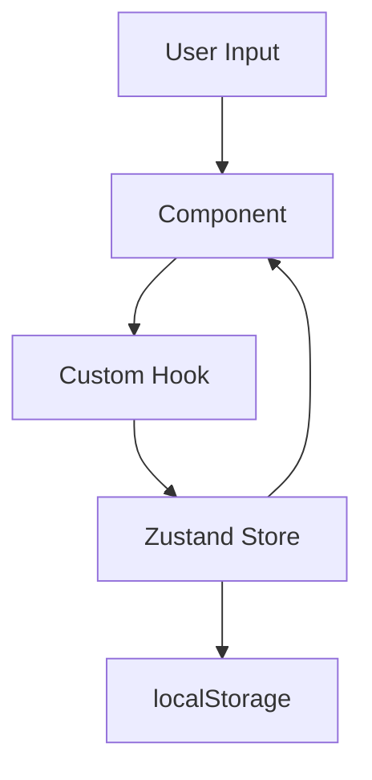

# Arquitetura

## Estrutura de Pastas

```
src/
├── @types/           # Tipagens globais
├── assets/           # Assets estáticos
├── commons/          # Utilitários compartilhados
├── components/       # Componentes React reutilizáveis
│   ├── navigation/   # Navbar, MobileNav
│   ├── onboarding/   # Sistema de onboarding
│   ├── ui/           # Biblioteca UI (Button, Card, etc.)
│   └── ...           # Componentes de feature
├── features/         # Regras de negócio
│   ├── timer/        # Hook useTimer
│   ├── scramble/     # Gerador de scrambles
│   ├── stats/        # Cálculos estatísticos
│   ├── onboarding/   # Configuração do onboarding
│   └── training/     # Casos de treino (PLL, OLL, F2L)
├── hooks/            # Custom hooks globais
│   ├── useTheme.ts   # Controle de tema
│   └── useTranslation.ts
├── i18n/             # Internacionalização
│   └── locales/      # Arquivos de tradução
├── layouts/          # Layouts de página
│   └── MainLayout.tsx
├── pages/            # Páginas da aplicação
│   ├── homePage/     # Timer principal
│   ├── historyPage/  # Histórico de solves
│   ├── statsPage/    # Estatísticas avançadas
│   ├── trainingPage/ # Modo de treino
│   ├── tutorialPage/ # Tutorial layer-by-layer
│   └── settingsPage/ # Configurações
├── stores/           # Zustand stores
├── styles/           # CSS global
├── test/             # Configuração de testes
└── utils/            # Funções utilitárias
```

## Padrões de Código

### Separação de Responsabilidades

- **Componentes (.tsx):** Apenas renderização e UI
- **Hooks (.ts):** Lógica de negócio
- **Stores (.ts):** Estado global

### Convenções

- Comentários mínimos, apenas para lógica complexa
- Comentários sempre em inglês
- Código auto-documentado preferido
- TypeScript strict mode

## Fluxo de Dados



## Modelo de Dados

```ts
type Penalty = "NONE" | "+2" | "DNF";

type Solve = {
  id: string;           // UUID
  timeMs: number;       // Tempo bruto em ms
  penalty: Penalty;     // Penalidade aplicada
  effectiveMs: number;  // timeMs ajustado (+2) ou Infinity se DNF
  scramble: string;     // Notação 3×3
  createdAt: string;    // ISO timestamp
};

type Session = {
  id: string;
  name: string;
  solves: Solve[];
};
```

## Rotas

| Rota | Página | Descrição |
|------|--------|-----------|
| `/` | HomePage | Timer principal |
| `/history` | HistoryPage | Tabela de solves |
| `/stats` | StatsPage | Gráficos e métricas |
| `/training` | TrainingPage | Treino de casos |
| `/tutorial` | TutorialPage | Tutorial passo-a-passo |
| `/settings` | SettingsPage | Configurações |
