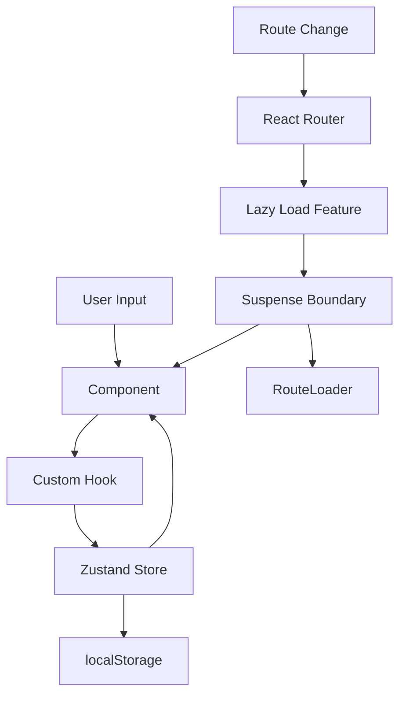

# Documentação Técnica

## Proposta de Valor

| Pilar | Descrição |
|-------|--------------|
| **Clareza primeiro** | Tempos, médias e PB sem poluição visual |
| **Aprenda jogando** | Dicas sobre ao5/ao12 e TPS após cada sessão |
| **Aconchego visual** | Contraste alto, tipografia grande, zero distração |

## Stack Tecnológica

| Tecnologia | Versão | Propósito |
|------------|--------|-----------|
| React | 19 | UI declarativa |
| TypeScript | 5.9 | Type safety |
| Vite | rolldown-vite | Build ultrarrápido |
| Tailwind CSS | 4 | Estilização com CSS variables |
| Zustand | 5 | Estado global com persistência |
| Framer Motion | 12 | Animações fluidas |
| React Router | 7 | Navegação client-side |
| Recharts | 3 | Gráficos responsivos |
| Solar Icons | 1.0.1 | Biblioteca de ícones |
| Vitest | 4 | Testes unitários |
| Biome | 2 | Linting e formatting |
| vite-plugin-pwa | 1 | PWA support |

## Requisitos

- Node.js 18+
- pnpm 8+

## Scripts

```bash
pnpm dev       # Servidor de desenvolvimento
pnpm build     # Build de produção
pnpm preview   # Preview do build
pnpm test      # Executar testes
pnpm check     # Lint e format com Biome
```

## Temas

- **Dark (padrão):** Fundo `#0D1117`, primário `#7C4DFF`, acento `#39FF88`
- **Light:** Fundo branco, contraste otimizado

CSS variables para fácil customização em `/src/app/styles/index.css`.

---

## Estrutura de Pastas

```
src/
├── app/                  # Core application setup
│   ├── app-router.tsx   # React Router configuration with lazy loading
│   ├── app.tsx          # Root component
│   ├── main.tsx         # Entry point
│   └── styles/          # Global CSS
│
├── features/            # Feature-based modules (self-contained)
│   ├── home/           # Timer page (main feature)
│   │   ├── components/ # Feature-specific components
│   │   │   ├── timer-display/
│   │   │   ├── scramble-box/
│   │   │   ├── inspection-display/
│   │   │   └── stat-card/
│   │   ├── lib/        # Business logic
│   │   │   ├── use-timer.ts
│   │   │   └── scramble/
│   │   ├── home.tsx    # Page component
│   │   └── index.ts    # Barrel export
│   │
│   ├── history/        # Solve history page
│   ├── stats/          # Advanced stats page
│   ├── training/       # Training mode page
│   ├── tutorial/       # Tutorial page
│   └── settings/       # Settings page
│
├── shared/             # Shared code across features
│   ├── components/     # Reusable UI components
│   │   ├── ui/         # Design system (Button, Card, Modal, etc.)
│   │   ├── navigation/ # Navbar, MobileNav
│   │   ├── route-loader/    # Loading component for lazy routes
│   │   ├── session-switcher/
│   │   ├── language-selector/
│   │   ├── scramble-guide-modal/
│   │   ├── cube-visualizer/
│   │   ├── onboarding/
│   │   └── ...
│   │
│   ├── lib/           # Utilities and helpers
│   │   ├── animations.ts    # Framer Motion variants
│   │   ├── sounds.ts        # Web Audio API
│   │   ├── format-time.ts   # Time formatters
│   │   └── cn.ts            # Class name utility
│   │
│   ├── store/         # Global state management
│   │   ├── sessions-store.ts
│   │   ├── settings-store.ts
│   │   ├── i18n-store.ts
│   │   ├── onboarding-store.ts
│   │   ├── training-store.ts
│   │   └── tutorial-store.ts
│   │
│   ├── config/        # Configuration
│   │   └── i18n/      # Internationalization
│   │       └── locales/
│   │           ├── pt-BR.ts
│   │           ├── en-US.ts
│   │           └── es-ES.ts
│   │
│   ├── hooks/         # Custom hooks
│   │   ├── use-translation.ts
│   │   └── use-theme.ts
│   │
│   ├── types/         # TypeScript types
│   │   └── solve.ts
│   │
│   └── layouts/       # Page layouts
│       └── main-layout.tsx
│
└── @types/           # Global TypeScript definitions
```

## Padrões de Código

### Separação de Responsabilidades

- **Componentes (.tsx):** Apenas renderização e UI
- **Hooks (.ts):** Lógica de negócio
- **Stores (.ts):** Estado global

### Feature-Based Organization

Cada feature em `/src/features/` é **auto-contida**:
- Componentes específicos da feature
- Lógica de negócio (hooks, utils)
- Testes da feature
- Exportação via barrel (index.ts)

**Benefícios:**
- 🎯 **Alta coesão:** Código relacionado agrupado
- 🔌 **Baixo acoplamento:** Features independentes
- 📦 **Fácil remoção:** Deletar pasta = deletar feature
- 🧪 **Testabilidade:** Testes colocados com código

### Componentes Compartilhados

`/src/shared/components/` contém apenas componentes **verdadeiramente reutilizáveis**:
- Sistema de UI (Button, Card, Modal)
- Navegação (Navbar, MobileNav)
- Componentes usados em múltiplas features

Se um componente é usado apenas em uma feature, ele fica em `/features/[feature]/components/`.

### Convenções

- Comentários mínimos, apenas para lógica complexa
- Comentários sempre em inglês
- Código auto-documentado preferido
- TypeScript strict mode habilitado
- Barrel exports para facilitar imports

## Fluxo de Dados



## Modelo de Dados

```ts
type Penalty = "NONE" | "+2" | "DNF";

type Solve = {
  id: string;           // UUID
  timeMs: number;       // Tempo bruto em ms
  penalty: Penalty;     // Penalidade aplicada
  effectiveMs: number;  // timeMs ajustado (+2) ou Infinity se DNF
  scramble: string;     // Notação 3×3
  createdAt: string;    // ISO timestamp
};

type Session = {
  id: string;
  name: string;
  solves: Solve[];
};
```

## Rotas

| Rota | Página | Lazy Loaded | Descrição |
|------|--------|-------------|-----------|
| `/` | home | ✅ | Timer principal e dashboard |
| `/history` | history | ✅ | Tabela completa de solves |
| `/stats` | stats | ✅ | Gráficos e métricas avançadas |
| `/training` | training | ✅ | Treino de casos (PLL/OLL/F2L) |
| `/tutorial` | tutorial | ✅ | Tutorial layer-by-layer |
| `/settings` | settings | ✅ | Configurações do app |

Todas as rotas usam **lazy loading** via `React.lazy()` para otimizar bundle size.

## Code Splitting

### Strategy

1. **Route-based splitting:** Cada página é um chunk separado
2. **Vendor separation:** Bibliotecas grandes isoladas (React, recharts, framer-motion)
3. **Suspense boundaries:** `RouteLoader` exibido durante carregamento

### Results

- Main bundle: **135 KB** (gzipped: 40 KB)
- Per-route chunks: **6-16 KB** each
- Vendor chunks: Cached separadamente

Veja [performance.md](./performance.md) para detalhes completos.

## Design System

### Componentes UI Base

Localizados em `/src/shared/components/ui/`:

- **Button:** 6 variantes, 4 tamanhos
- **Card:** 3 variantes (surface, background, overlay)
- **Modal:** Base para todos os modais

### Theme System

- **CSS Variables:** Cores semânticas por tema
- **useTheme Hook:** Controle programático
- **Suporte:** Dark (padrão) e Light

## Internacionalização

### Estrutura

```
/src/shared/config/i18n/
  locales/
    ├── pt-BR.ts    # Português (padrão)
    ├── en-US.ts    # English
    └── es-ES.ts    # Español
```

### Uso

```tsx
import { useI18nStore } from '@/shared/store/i18n-store';

const { t } = useI18nStore();
// t.timer.ready, t.scramble.title, etc.
```

Veja [i18n.md](./i18n.md) para detalhes completos.

## State Management

### Zustand Stores

Todos em `/src/shared/store/`:

| Store | Persisted | Função |
|-------|-----------|--------|
| sessions-store | ✅ | Solves e sessões |
| settings-store | ✅ | Configurações do usuário |
| i18n-store | ✅ | Idioma ativo |
| onboarding-store | ✅ | Estado do tour |
| training-store | ✅ | Progresso de treino |
| tutorial-store | ❌ | Estado do modal de tutorial |

Veja [stores.md](./stores.md) para detalhes completos.

## Testing

- **Framework:** Vitest + React Testing Library
- **Location:** `__tests__/` dentro de cada feature
- **Coverage:** Business logic (stats, scramble, hooks)

## Build Process

1. **TypeScript:** Compilação com strict mode
2. **Vite:** Build tool com Rolldown
3. **Code Splitting:** Manual chunks para vendors
4. **PWA:** Service worker gerado automaticamente
5. **Assets:** Otimização de imagens e fonts
