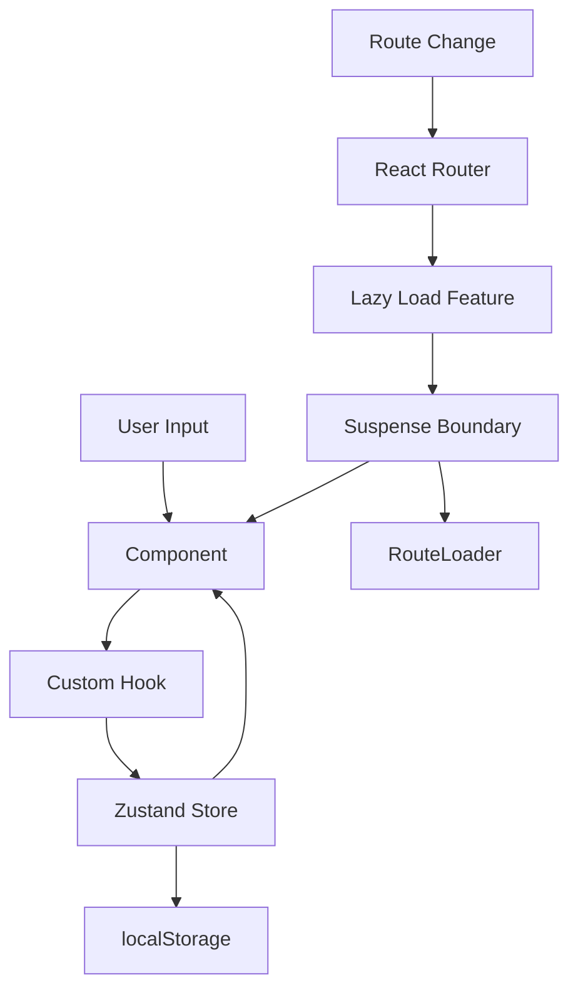

# Documentação Técnica

## Proposta de Valor

| Pilar | Descrição |
|-------|--------------|
| **Clareza primeiro** | Tempos, médias e PB sem poluição visual |
| **Aprenda jogando** | Dicas sobre ao5/ao12 e TPS após cada sessão |
| **Aconchego visual** | Contraste alto, tipografia grande, zero distração |

## Stack Tecnológica

| Tecnologia | Versão | Propósito |
|------------|--------|-----------|
| React | 19 | UI declarativa |
| TypeScript | 5.9 | Type safety |
| Vite | rolldown-vite | Build ultrarrápido |
| Tailwind CSS | 4 | Estilização com CSS variables |
| Zustand | 5 | Estado global com persistência |
| Framer Motion | 12 | Animações fluidas |
| React Router | 7 | Navegação client-side |
| Recharts | 3 | Gráficos responsivos |
| Solar Icons | 1.0.1 | Biblioteca de ícones |
| Vitest | 4 | Testes unitários |
| Biome | 2 | Linting e formatting |
| vite-plugin-pwa | 1 | PWA support |

## Requisitos

- Node.js 18+
- pnpm 8+

## Scripts

```bash
pnpm dev       # Servidor de desenvolvimento
pnpm build     # Build de produção
pnpm preview   # Preview do build
pnpm test      # Executar testes
pnpm check     # Lint e format com Biome
```

## Temas

- **Dark (padrão):** Base graphite `#0B1017`, superfícies `#111923`/`#18212D`, primário `#7A6FF0`, acento reservado `#3DCF8E`
- **Light:** Base paper `#F6F7FB`, superfícies `#FFFFFF`/`#EDF1F8`, primário `#6D61E0`, feedback semântico preservado

CSS variables para fácil customização em `/src/app/styles/index.css`.

---

## Estrutura de Pastas

```
src/
├── app/                  # Core application setup
│   ├── app-router.tsx   # React Router configuration with lazy loading
│   ├── app.tsx          # Root component
│   ├── main.tsx         # Entry point
│   └── styles/          # Global CSS
│
├── features/            # Feature-based modules (self-contained)
│   ├── home/           # Timer page (main feature)
│   │   ├── components/ # Feature-specific components
│   │   │   ├── timer-display/
│   │   │   ├── scramble-box/
│   │   │   ├── inspection-display/
│   │   │   └── stat-card/
│   │   ├── lib/        # Business logic
│   │   │   ├── use-timer.ts
│   │   │   └── scramble/
│   │   ├── home.tsx    # Page component
│   │   └── index.ts    # Barrel export
│   │
│   ├── history/        # Solve history page
│   ├── stats/          # Advanced stats page
│   ├── training/       # Training mode page
│   ├── tutorial/       # Tutorial page
│   └── settings/       # Settings page
│
├── shared/             # Shared code across features
│   ├── components/     # Reusable UI components
│   │   ├── ui/         # Design system (Button, Card, Modal, etc.)
│   │   ├── navigation/ # Navbar, MobileNav
│   │   ├── route-loader/    # Loading component for lazy routes
│   │   ├── session-switcher/
│   │   ├── language-selector/
│   │   ├── scramble-guide-modal/
│   │   ├── cube-visualizer/
│   │   ├── onboarding/
│   │   └── ...
│   │
│   ├── lib/           # Utilities and helpers
│   │   ├── animations.ts    # Framer Motion variants
│   │   ├── sounds.ts        # Web Audio API
│   │   ├── format-time.ts   # Time formatters
│   │   └── cn.ts            # Class name utility
│   │
│   ├── store/         # Global state management
│   │   ├── sessions-store.ts
│   │   ├── settings-store.ts
│   │   ├── i18n-store.ts
│   │   ├── onboarding-store.ts
│   │   ├── training-store.ts
│   │   └── tutorial-store.ts
│   │
│   ├── config/        # Configuration
│   │   └── i18n/      # Internationalization
│   │       └── locales/
│   │           ├── pt-BR.ts
│   │           ├── en-US.ts
│   │           └── es-ES.ts
│   │
│   ├── hooks/         # Custom hooks
│   │   ├── use-translation.ts
│   │   └── use-theme.ts
│   │
│   ├── types/         # TypeScript types
│   │   └── solve.ts
│   │
│   └── layouts/       # Page layouts
│       └── main-layout.tsx
│
└── @types/           # Global TypeScript definitions
```

## Padrões de Código

### Separação de Responsabilidades

- **Componentes (.tsx):** Apenas renderização e UI
- **Hooks (.ts):** Lógica de negócio
- **Stores (.ts):** Estado global

### Feature-Based Organization

Cada feature em `/src/features/` é **auto-contida**:
- Componentes específicos da feature
- Lógica de negócio (hooks, utils)
- Testes da feature
- Exportação via barrel (index.ts)

**Benefícios:**
- 🎯 **Alta coesão:** Código relacionado agrupado
- 🔌 **Baixo acoplamento:** Features independentes
- 📦 **Fácil remoção:** Deletar pasta = deletar feature
- 🧪 **Testabilidade:** Testes colocados com código

### Componentes Compartilhados

`/src/shared/components/` contém apenas componentes **verdadeiramente reutilizáveis**:
- Sistema de UI (Button, Card, Modal)
- Navegação (Navbar, MobileNav)
- Componentes usados em múltiplas features

Se um componente é usado apenas em uma feature, ele fica em `/features/[feature]/components/`.

### Convenções

- Comentários mínimos, apenas para lógica complexa
- Comentários sempre em inglês
- Código auto-documentado preferido
- TypeScript strict mode habilitado
- Barrel exports para facilitar imports

## Fluxo de Dados


```mermaid
graph TD
    A[User Input] --> B[Component]
    B --> C[Custom Hook]
    C --> D[Zustand Store]
    D --> E[localStorage]
    D --> B
    
    F[Route Change] --> G[React Router]
    G --> H[Lazy Load Feature]
    H --> I[Suspense Boundary]
    I --> J[RouteLoader]
    I --> B
```

## Modelo de Dados

```ts
type Penalty = "NONE" | "+2" | "DNF";

type Solve = {
  id: string;           // UUID
  timeMs: number;       // Tempo bruto em ms
  penalty: Penalty;     // Penalidade aplicada
  effectiveMs: number;  // timeMs ajustado (+2) ou Infinity se DNF
  scramble: string;     // Notação 3×3
  createdAt: string;    // ISO timestamp
};

type Session = {
  id: string;
  name: string;
  solves: Solve[];
};
```

## Rotas

| Rota | Página | Lazy Loaded | Descrição |
|------|--------|-------------|-----------|
| `/` | home | ✅ | Timer principal e dashboard |
| `/history` | history | ✅ | Tabela completa de solves |
| `/stats` | stats | ✅ | Gráficos e métricas avançadas |
| `/training` | training | ✅ | Treino de casos (PLL/OLL/F2L) |
| `/tutorial` | tutorial | ✅ | Tutorial layer-by-layer |
| `/settings` | settings | ✅ | Configurações do app |

Todas as rotas usam **lazy loading** via `React.lazy()` para otimizar bundle size.

## Layout Shell

- `MainLayout` define o shell global do app com altura fixa no viewport (`100dvh` quando disponível).
- `Topbar` permanece sempre visível enquanto o scroll vertical fica restrito ao `main.app-shell-main`.
- `body` e `#root` não participam do scroll das rotas principais; backgrounds decorativos vivem em uma única camada (`app-shell-backdrop`).
- Páginas dentro do shell devem usar o contrato `app-shell-page` e evitar `min-h-screen`/`overflow-*` no root da rota.
- `RouteLoader` distingue fallback fullscreen (rotas fora do shell) de fallback interno, evitando layout shift durante lazy loading.
- Mobile-first: a navegação primária em telas pequenas mora em `MobileNav`, fixada no rodapé com safe area, enquanto `Aprender` e `Mais` abrem sheets para rotas secundárias.
- Desktop: `Sidebar` agrupa rotas por contexto (`Fluxo principal`, `Aprender`, `Comunidade`, `Ferramentas`) para reduzir repetição visual e manter a IA consistente com o PRD.
- `Topbar` virou barra utilitária: contexto da rota ativa no desktop, logo no mobile e controles globais (`PuzzleSelector`, `SessionSwitcher`, idioma) com densidade alinhada.
- `app-shell-topbar`, `app-shell-mobile-nav` e `app-shell-main` são os contratos de safe area do shell; qualquer CTA fixo adicional precisa coexistir com esse padding.

## Code Splitting

### Strategy

1. **Route-based splitting:** Cada página é um chunk separado
2. **Vendor separation:** Bibliotecas grandes isoladas (React, recharts, framer-motion)
3. **Suspense boundaries:** `RouteLoader` exibido durante carregamento

### Results

- Main bundle: **135 KB** (gzipped: 40 KB)
- Per-route chunks: **6-16 KB** each
- Vendor chunks: Cached separadamente

Veja [performance.md](./performance.md) para detalhes completos.

## Design System

### Foundations

- **Color tokens:** paleta semântica em `src/app/styles/index.css`, com `background`, `surface`, `overlay`, `border`, `text`, `primary`, `accent` e feedback (`success`, `warning`, `danger`, `info`).
- **Type and spacing:** escala base para display/title/body/caption e espaçamentos utilitários compartilhados via CSS variables.
- **Radius and elevation:** `radius-sm/md/lg/xl` e `klick-shadow-1/2/3` definem os três níveis máximos de profundidade do redesign.
- **Motion:** `motion-fast/base/slow` e `ease-standard` padronizam transições curtas e discretas.
- **Surface contract:** `surface-base`, `surface-panel`, `surface-overlay` e `surface-shell` são as superfícies canônicas; `surface-interactive` e `feedback-*` cobrem estados compartilhados.
- **Visual anti-patterns:** glow forte, blur pesado e gradientes amplos deixaram de ser o padrão; agora ficam restritos a destaque intencional, nunca como tratamento default de containers.

### Componentes UI Base

Localizados em `/src/shared/components/ui/`:

- **Button:** 6 variantes, 4 tamanhos
- **Card:** 3 variantes (surface, background, overlay)
- **Modal:** Base para todos os modais
- **DropdownMenu:** Trigger/content alinhados ao mesmo contrato de superfícies do shell e dos controles globais
- **ToggleButton / RadioGroup:** Controles binários e de seleção alinhados aos novos estados de foco e contraste

### Theme System

- **CSS Variables:** Cores semânticas por tema
- **Surface classes:** superfícies e feedback compartilhado definidos em `src/app/styles/index.css`
- **useTheme Hook:** Controle programático
- **Suporte:** Dark (padrão) e Light

## Contrato do Cubo 3D

- `CubePlatform` é a API compartilhada para previews e experiências guiadas do cubo.
- O contrato atual suporta `mode="static" | "autoplay" | "step-by-step"`.
- `initialAlgorithm` monta o caso-base sem animação; `algorithm` define a sequência de playback/reprodução.
- `cameraPreset` centraliza orientações por contexto (`home`, `tutorial`, `training`, `explorer`, `front`, `top-front`, `front-right`).
- `useCubePlatformController` é o source of truth de playback: play, pause, next, previous, restart, finish e speed (`slow`, `normal`, `fast`).
- `prefers-reduced-motion` desativa autoplay agressivo, convertendo previews automáticos em fluxo guiado/pausado.
- Telemetria de uso do visualizador fica em `src/shared/store/cube-platform-telemetry-store.ts`, com eventos de play/pause/step/speed/restart/finish.

## Internacionalização

### Estrutura

```
/src/shared/config/i18n/
  locales/
    ├── pt-BR.ts    # Português (padrão)
    ├── en-US.ts    # English
    └── es-ES.ts    # Español
```

### Uso

```tsx
import { useI18nStore } from '@/shared/store/i18n-store';

const { t } = useI18nStore();
// t.timer.ready, t.scramble.title, etc.
```

Veja [i18n.md](./i18n.md) para detalhes completos.

## State Management

### Zustand Stores

Todos em `/src/shared/store/`:

| Store | Persisted | Função |
|-------|-----------|--------|
| sessions-store | ✅ | Solves e sessões |
| settings-store | ✅ | Configurações do usuário |
| i18n-store | ✅ | Idioma ativo |
| onboarding-store | ✅ | Estado do tour |
| training-store | ✅ | Progresso de treino |
| tutorial-store | ❌ | Estado do modal de tutorial |

Veja [stores.md](./stores.md) para detalhes completos.

## Testing

- **Framework:** Vitest + React Testing Library
- **Location:** `__tests__/` dentro de cada feature
- **Coverage:** Business logic (stats, scramble, hooks)

## Build Process

1. **TypeScript:** Compilação com strict mode
2. **Vite:** Build tool com Rolldown
3. **Code Splitting:** Manual chunks para vendors
4. **PWA:** Service worker gerado automaticamente
5. **Assets:** Otimização de imagens e fonts

## Definition of Done (Engineering)

### Mandatory Checklist

- **Architecture:** separação clara entre apresentação (components), lógica (hooks/lib) e estado (stores).
- **Module contracts:** evitar acoplamento direto entre features; reutilização passa por `src/shared`.
- **Code hygiene:** remover arquivos/exports/dependências sem uso na mesma entrega.
- **Quality gates:** `pnpm lint`, `pnpm test`, `pnpm knip` devem passar antes de merge.
- **Traceability:** decisões estruturais relevantes devem ser registradas no progresso técnico (`scripts/ralph/progress.txt`).

### Folder and Contract Conventions

- `src/features/[feature]` é dono do fluxo da feature e não deve importar outra feature diretamente.
- `src/shared` contém apenas contratos/utilitários/componentes com uso comprovado em mais de uma área.
- `index.ts` deve ter superfície mínima: exportar somente símbolos usados por consumidores reais.
- Quando houver refatoração estrutural, remover código legado no mesmo ciclo para evitar drift arquitetural.

### Forbidden Anti-patterns

- Duplicar regra de negócio em módulos paralelos (`feature` e `shared`) sem fonte única.
- Manter implementações legadas em paralelo após migração concluída.
- Exportar APIs “para uso futuro” sem consumidor.
- Manter dependências no `package.json` sem uso real.
